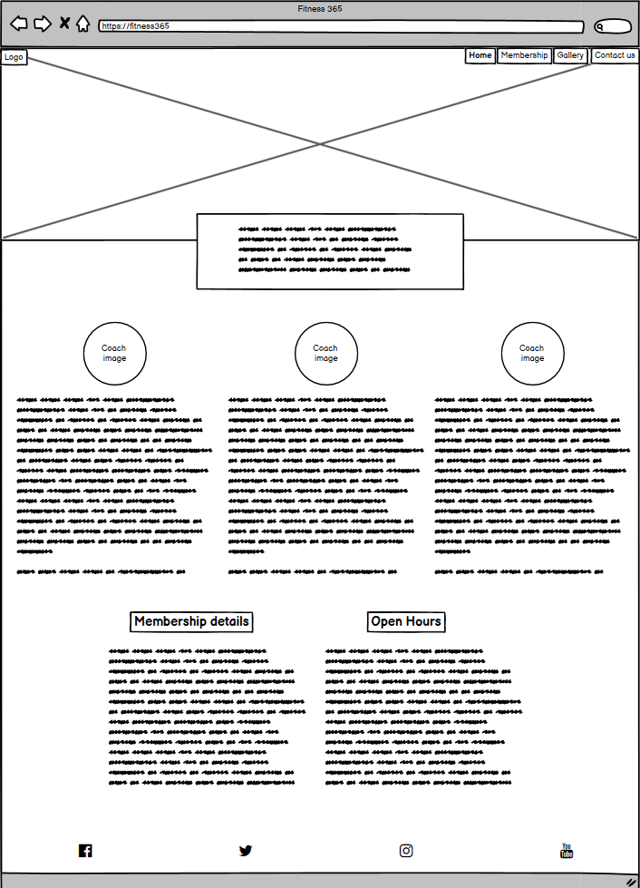
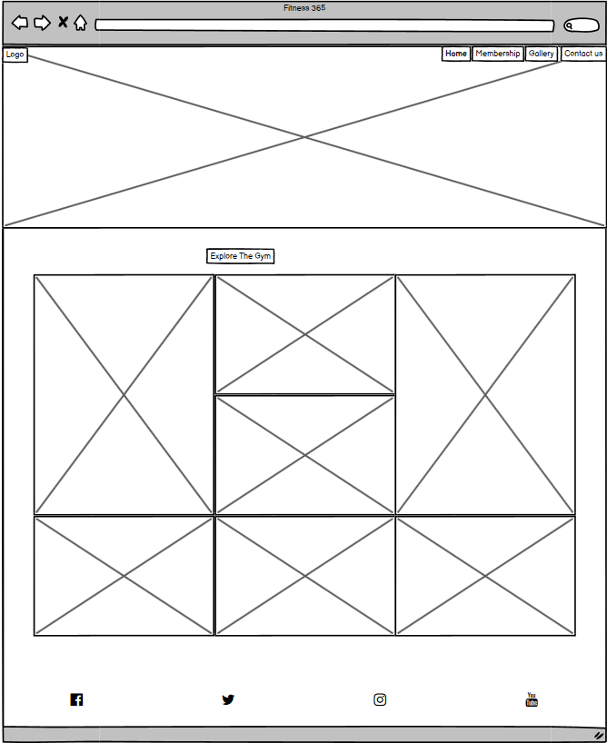
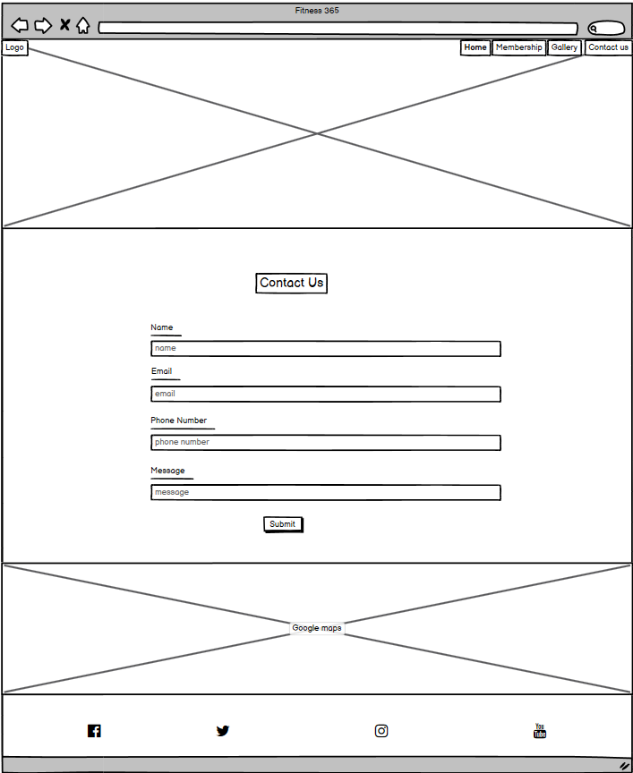
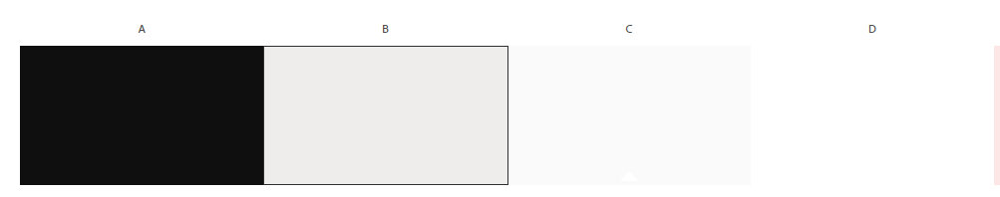

# Fitness 365

This is a website for Fitness 365, a gym based in the heart of Limerick City, Ireland. Fitness 365 is a fully equipped gym that also runs group classes daily aswell as private one to one training sessions. The website is to inform you about the new gym and to provide as much information as possible about what Fitness 365 offers all the while being easy to navigate.

 ## UX Design:

### Site Wireframes
Below are the wireframes for Fitness 365 which were created using Balsamiq.

- #### Homepage
 ( )

 - #### Gallery Page

- #### Contact Page

* Just to mention, the membership tab, when clicked brings you to the section of the homepage that has the memembership information, hence why i did   not create wireframe for it.

### Color Scheme
 The color scheme for the website was kept simple with black, grey and white which allows for high contrast between the text and background color.

### Fonts
The fonts that we used for the site were:
- Allerta Stencil was used for Logo.
- Athiti was used for the body.

## Features:

## Technologies Used:

## Testing:

## Deployment:

## Credits:
