# Fitness 365

This is a website for Fitness 365, a gym based in the heart of Limerick City, Ireland. Fitness 365 is a fully equipped gym that also runs group classes daily aswell as private one to one training sessions. The website is to inform you about the new gym and to provide as much information as possible about what Fitness 365 offers all the while being easy to navigate.

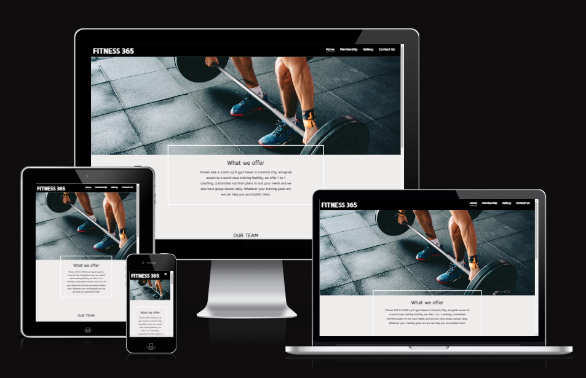

- - -

 ## UX Design:

### Site Wireframes
Below are the wireframes for Fitness 365 which were created using Balsamiq.

 #### Homepage
   

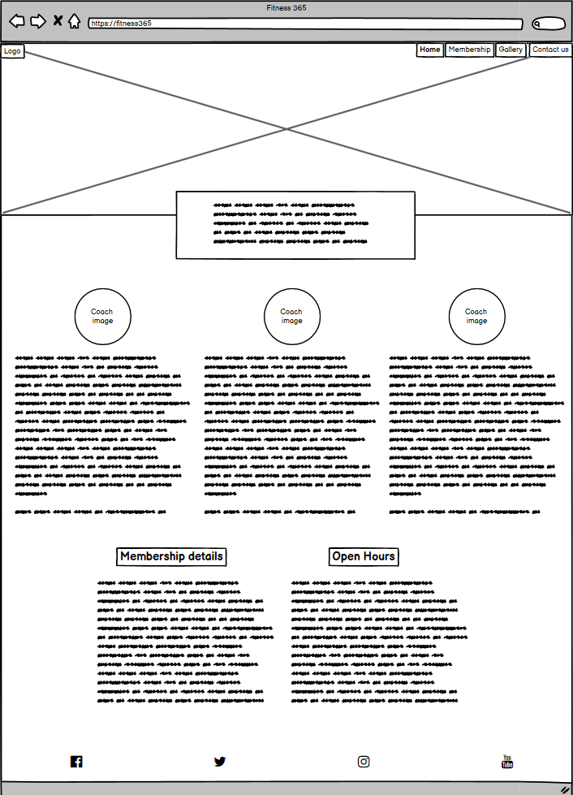

#### Gallery Page
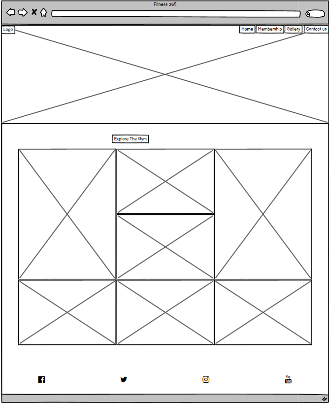

 #### Contact Page
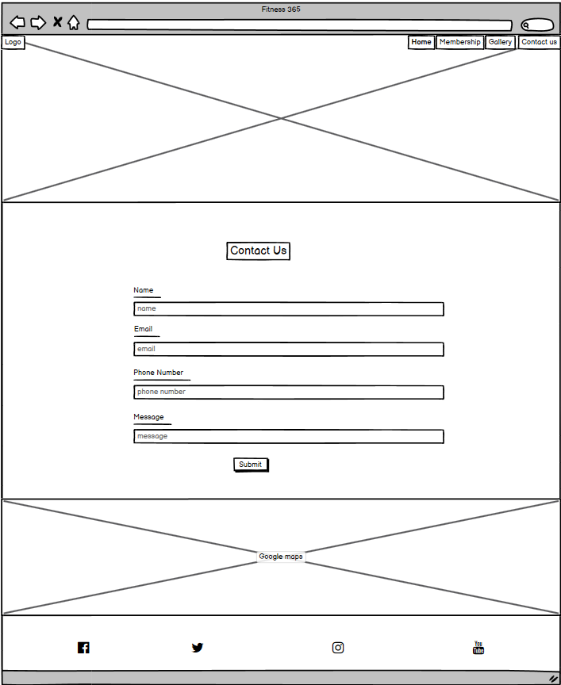

* Just to mention, the membership tab, when clicked brings you to the section of the homepage that has the membership information, hence why i did   not create wireframe for it.
- - -

### Color Scheme
 The color scheme for the website was kept simple with black, grey and white which allows for high contrast between the text and background color.
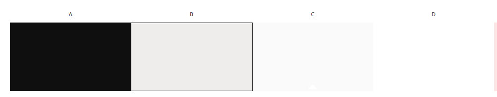
- - -

### Typography
The fonts that I used for the site were:
- Allerta Stencil was used for Logo.
- Athiti was used for the body.
- - -

## Features:

### Navigation Bar
- The navigarion bar sits at the very top of each page, with the logo displayed at the left hand side, and the links to each page displayed at the left.
- When on a mobile or tablet the the links change to a burger menu that when click shows all page links. 
- The colors used were a black background and white text to make the Nav bar stand out and be clearly visible. 
- The page you are currently on displays a white line underneath.

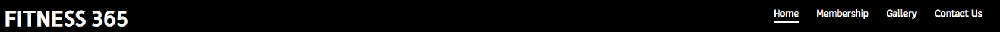

 - **Nav bar on mobile and tablets**
 

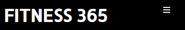
- - -

### Hero Image
- The hero section is found on the home and contact page directly below the Navigation bar.
- It is an image of a weighted barbell with a person holding it about to do a dead lift.
- It spans the width of the device  and is 500px in heigh on desktop and 150px height on mobile and small devices.

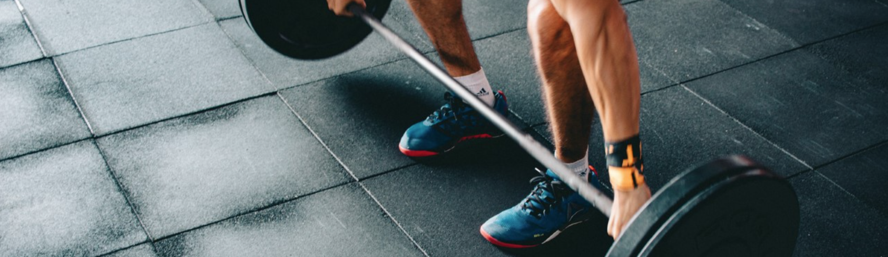
- - -

### Text Box area
- It is a transparent rectangular box with a white border and text in the middle.
- It is one of the things that catches the users eye at first glance when they reach the page and it gives a little synopsis about the gym.
- The box floats into the hero image about 50px on destop and 30px on smaller devices.
  
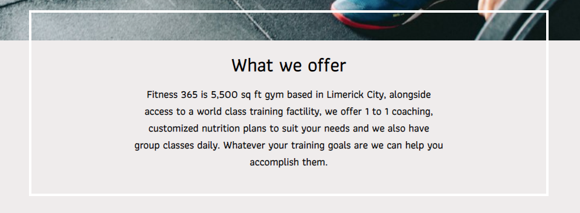
- - -

### Coaches
- This is the main section of the home page as it provides your infor mation about the coaches.
- In this section we have images of the 3 coaches with a bit about them underneath.
- On desktop they are displayed horizontially and on tablets and mobiles they are display vertically.
  
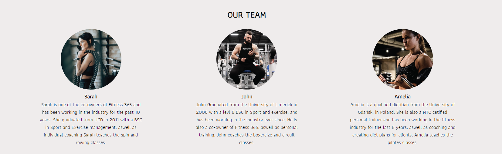
- - -

### Membership and opening hours
- We made a rectangle that stretches 80% of the page and is centered.
- The background color is white and the text is black for contrast.
- There is a black side border at each side to make it stand out and make it more visually appealing.
- Here you can find the membership prices on the left hand side and the opening hours on the right.
- The membership and opening hours section can be accessed from any page by clicking on the membership tab on the navigation bar.
   
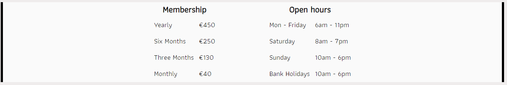
- - -

### Footer
- The footer is found at the bottom of each page and responsive for tablet and mobile too.
- It displays 4 icons for the biggest scoial media platfoms today, Twitter, Facebook, Youtube and Instagram.
- When any of the icons are clicked the social media site opens on a seperate Tab, this way the user still has the Fitness 365 website open so they can easily navigate back to it.  

 
- - -

### Gallery
- This page shows images of what the gym looks like, so the user can get a feel for what the gym has to offer and how it is layed out.
- The gallery is one of the main pages people will check out to see what the gym looks like inside so we tried to display each section with equipment clearly.
- On destops and laptops, images are 3 abreast, on device under 1280px they are 2 and on devices less thean 764px it is one image centered. 
  
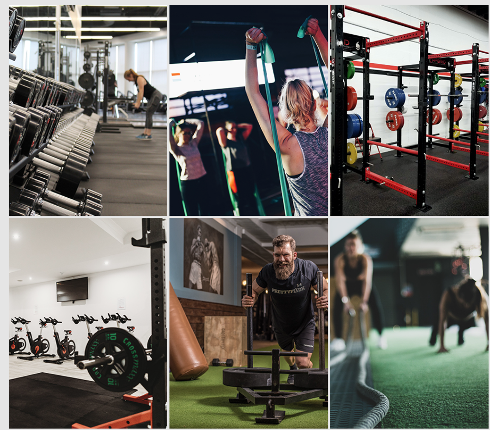  
- - -

 ### Contact Us page
- On the contact us page we have a form that a user can use to contact the gym with any query they have.
- The form takes the input for name, email , phone number and also the message that they want to submit.
- Below the form you will find the gym location with on an embedded google maps, the user can also view the map on a seperat page by click view larger map, which will take them to google maps, where they can get directions if they want.
  
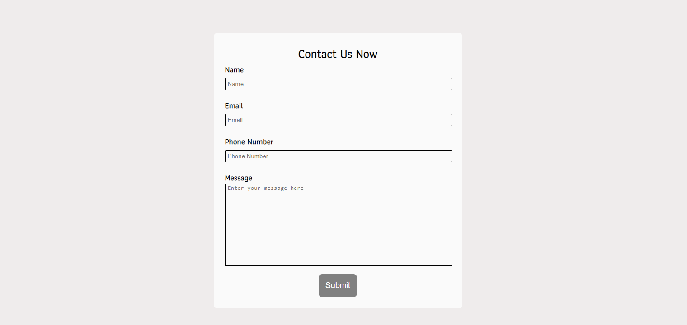  
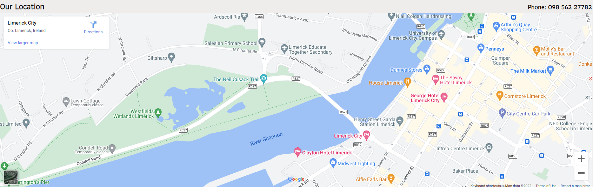  
- - - 

## Future Features:
In the future I would like to add a **Join now** button under the membership shection that when click will take th user to a secure payment page that allows the to purchse membership, This would need to be implemented through a secure third party payment site like paypal.
I would also like to add a video to the gallery page that gives a virtual tour of the gym so that users can get get a better view of the gym and how it is layed out.
- - -

## Technologies Used:
The technologies that were used to create the site were:
- HTML.
- CSS.
- JavaScript which was just used for the Navigation bar.
- Balsamiq was used to create the wireframes.
- Adobe Photoshop was used to resize some of the images.
- - -

## Testing:
To make sure the site was fully responsive and compatible with different browsers and device, I tested the site on Multiple devices as well as different browsers. I also ran my code through validators to makes sure there was no code or structural errors.

### Devices the site was tested on
Below is a list of devices which I test the site on and it was compatible with all:
- IPhone 11.
- Samsung S8.
- Sansung A52.
- Ipad 7.
- Amazon Fire.
- Dell Inspiron.
- Dell S2722DC monitor.
  
### Web browsers the site was tested on  
Below is a list of web browsers on which the site was tested and agin it was compatible with all:
- Google Chrome
- Microsoft Edge
- Firefox
- Safari
- - -

### Validator testing 
**HTML** 
- Each HTML page was tested for any sytax errors by running the code through the W3C validator which can be found [here](https://validator.w3.org/).
- The result was that there were no errors found for each page.  

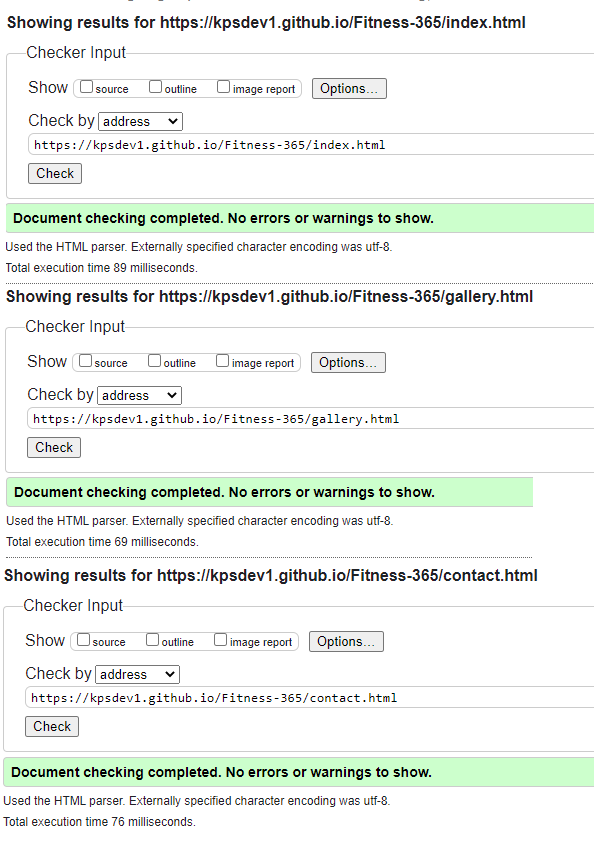
  
**CSS**
- The CSS file was tested for any errors by running the code through the W3C Jiqsaw validator which can be found [here](https://jigsaw.w3.org/css-validator/).
- The result also returned that there was no errors.  

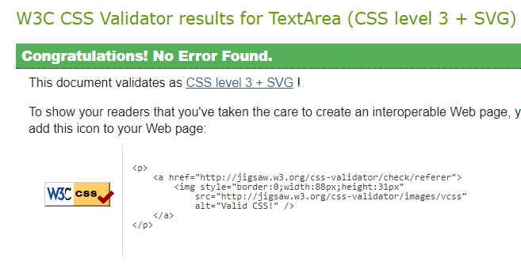
- - -

### Lighthouse
- I used Lighthouse in Chrome Dev tools to generate a report thats tests the sites Performance, Accessibility, Best practices and SEO.  

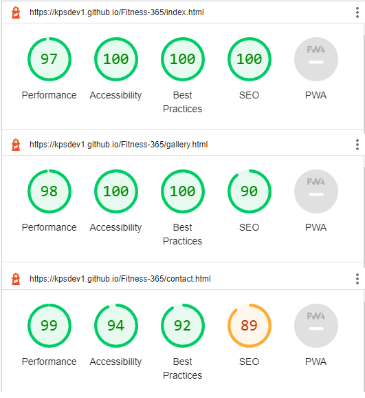
- - -
## Deployment:
The site is deployed using github pages. The following steps were used to deploy the site to Github pages:
- In github on the sites repositiory, click on the **Settings** button.
- On lefthand side menu. under **code and automation section** select **Pages**.
- Under **Branch** section, change the dropdown that says **none** to **main**.
- Then click **Save** and refresh the page, please note that it can take a few minutes for the site to be live.

## Credits:
